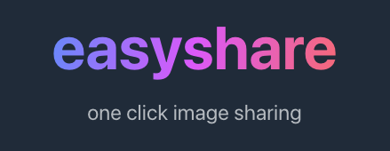

# easyshare &mdash; one click image sharing

### Usage

1.  Navigate to [easyshare.vishalshangari.com](https://easyshare.vishalshangari.com/)
2.  Upload an image!

### Motivation

As file-sharing platforms mature, they need to integrate additional features such as editing, the ability to browse other users' images, and sometimes require creation of an account. easyshare is a retro-prototype of a drag 'n' drop + share link image hosting service with the additional perk of pretty, unique URLs.

### Design

- Frontend: React + TypeScript
- Backend: Node.js (Express)
- Database: Google Cloud Firestore
- Storage: AWS S3

### Note

As this is just a rapid prototype, please note that all images are publicly accessibly by default and by intent. Please be careful what you upload!

### Requirements

- Firebase project (with Cloud Firestore DB enabled)
- AWS S3 bucket

### Configuration

Set up the following environment variables:

    S3_BUCKET_REGION=
    S3_BUCKET_NAME=
    S3_KEY=
    S3_SECRET=
    FIREBASE_PRIVATE_KEY=
    FIREBASE_PROJECT_ID=
    FIREBASE_CLIENT_EMAIL=
    // Optional for test database
    TEST_FIREBASE_PRIVATE_KEY=
    TEST_FIREBASE_PROJECT_ID=
    TEST_FIREBASE_CLIENT_EMAIL=
    // Required for configuring file uploads
    NODE_OPTIONS=--max-old-space-size=4096

### Installation Instructions

    git clone https://github.com/vishalshangari/easyshare

Install back-end dependencies:

    npm i

Install front-end dependencies:

    cd client
    npm i

### Run

Development:

    npm run dev

### Testing (optional)

To run upload test against test database, ensure a `test.json` config file is created (see above). Then simply:

    npm test

### Deploy

To deploy the application, create an additional environment variable:

    REACT_APP_PUBLIC_URL=[https://domain.xyz]

with your full public URL.

Then, on your server:

    npm build
    npm start
